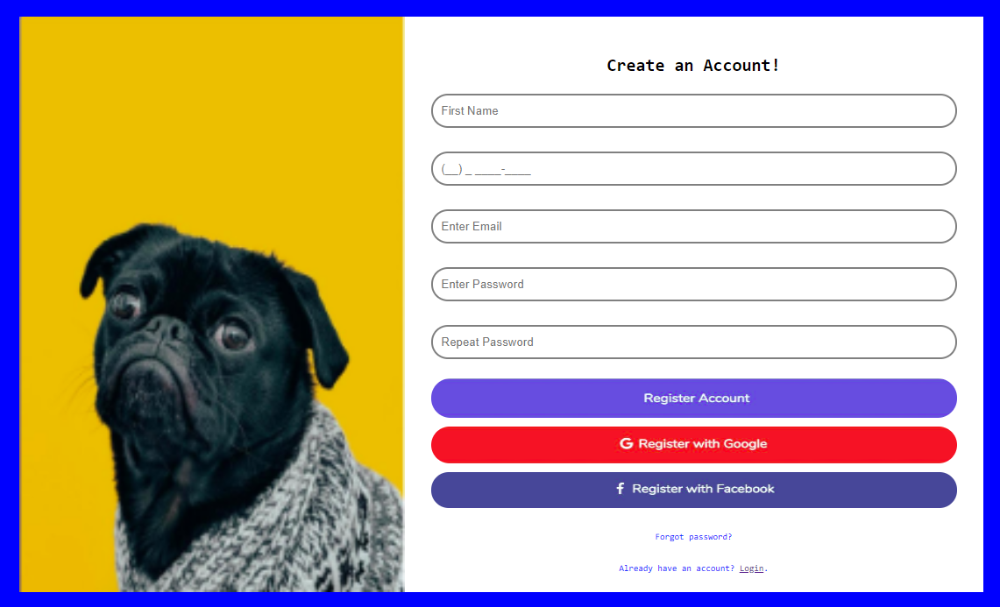
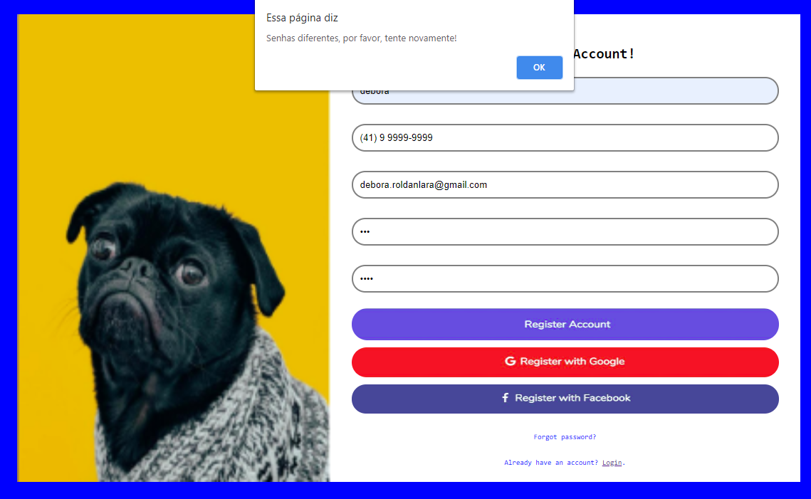
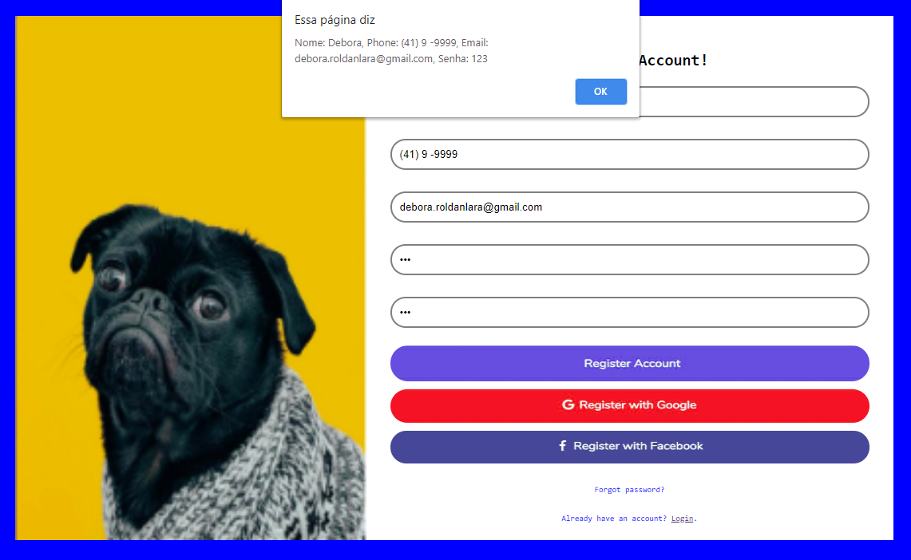

# :dog: Formulário desafio #1 
O formulário é um projeto que foi desenvolvido por meio de um desafio. A tela desenvolvida conta com um cadastro de login.
 
## :page_with_curl: Sobre o projeto
Este projeto foi desenvolvido com o objetivo de reproduzir e desenvolver uma tela de login, com o prazo de três dias e que deveria conter algumas validações.
São elas: Aviso de senha diferentes, área de telefone aceitar somente números e uma confirmação de registro no final com os dados adicionados no login.
 
 
## :rocket: Tecnologias usadas
 
Esse projeto foi desenvolvido com as seguintes tecnologias:
 
#### Frontend
* JavaScript
* JQuery
* CSS
* HTML
 
## Screenshots
 
#### Fomulário :page_with_curl:

 
#### Alertas :warning:

 
<table>
            	<tr>
                           	<th width="33.3%">
                                           	Senhas diferentes 
                           	</th>
                           	<th width="33.3%">
                                           	Confirmação de registro
                           	</th>
   </tr>
            	<tr><!-- Prevent zebra stripes --></tr>
   <tr>
		<td>
			
		</td>
		<td>
			
		</td>
  </tr>
            	
</table>

